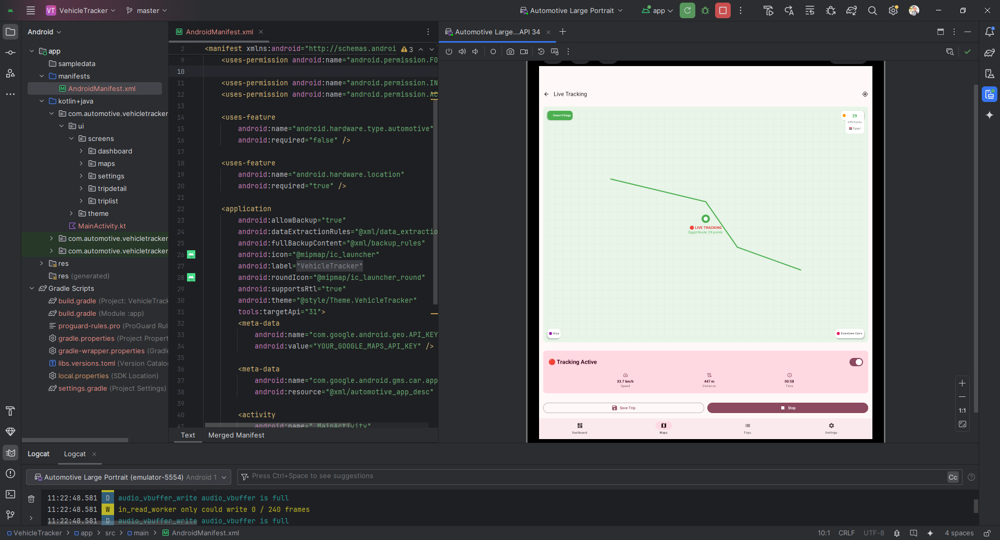
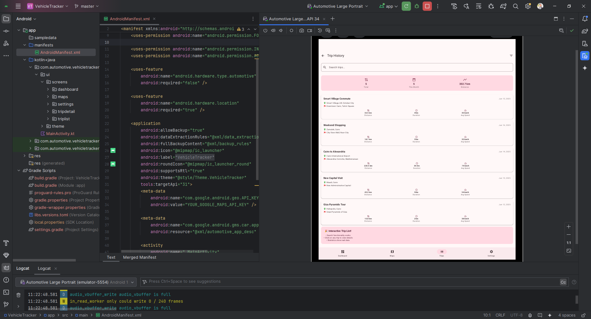
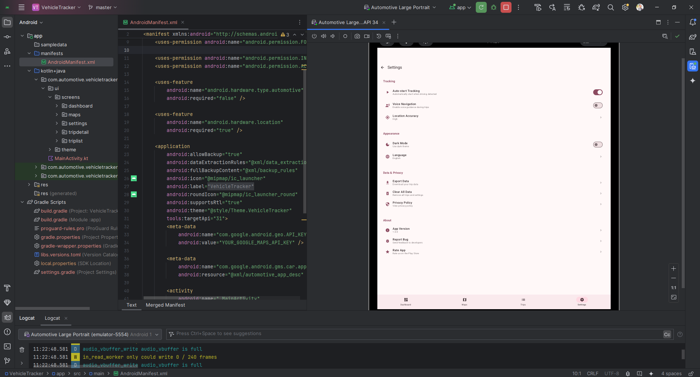

# 🚗 Vehicle Tracker - Android Automotive App

[](https://developer.android.com/training/cars)
[](https://kotlinlang.org)
[](https://developer.android.com/jetpack/compose)
[](https://material.io/design)

> **Professional Android Automotive OS application for vehicle tracking and trip management with real-time interactive features**

## 🎯 **Project Overview**

Vehicle Tracker is a modern Android Automotive application built with **Jetpack Compose** and **Material 3** design principles. The app provides an intuitive interface for tracking vehicle journeys, managing trip data, and monitoring driving statistics with real-time interactive features.

## 📸 **App Screenshots**

### **Dashboard - Interactive Statistics**

*Main dashboard with interactive statistics, Egyptian location data, and quick action buttons*

### **Live Tracking - Egyptian Routes**

*Real-time tracking with Smart Village to Cairo route visualization*

### **Trip History - Search & Filter**

*Advanced trip management with Egyptian locations and search functionality*

### **Settings - Professional Configuration**

*Organized settings with dark mode, GPS accuracy, and user preferences*

## 🎥 **Demo Video**

> **Coming Soon**: Full demonstration video showcasing all features, Egyptian location integration, and Android Automotive optimization

[](https://youtu.be/am2-xl6pmNE)

*Video will cover: Dashboard interactions, Live tracking simulation, Trip search functionality, Settings configuration, and Google Play Store publishing process*

---

## ✨ **Key Features**

### 🏠 **Dashboard**
- **Interactive Statistics**: Toggle between default and sample data views
- **Real-time Metrics**: Trip count, total distance, driving time, average speed
- **Quick Actions**: Start trip, view history, access settings with seamless navigation
- **Welcome Flow**: Professional onboarding showing app capabilities

### 🗺️ **Interactive Maps**
- **Real-time Tracking Simulation**: Start/stop tracking with live updates every 2 seconds
- **Dynamic Statistics**: Live speed (15-40 km/h), distance, elapsed time monitoring
- **Visual Feedback**: Map color changes during active tracking
- **Route Points Counter**: Number of recorded GPS locations
- **Smart Controls**: Save trip, error handling with auto-clear messages

### 📋 **Trip Management**
- **Advanced Search**: Real-time filtering by trip name, addresses, and details
- **Professional Trip Cards**: Status indicators, distance, duration, timestamps
- **Statistics Overview**: Total trips, monthly summaries, distance analytics
- **Empty State Handling**: User-friendly messages when no results found
- **Clickable Navigation**: Seamless transition to trip details

### 📊 **Trip Analytics**
- **Detailed Statistics**: Comprehensive trip information display
- **Route Analysis**: Start/end locations, distance, duration breakdown
- **Export Functionality**: Trip data sharing capabilities
- **Speed Analysis**: Performance metrics and driving behavior insights

### ⚙️ **Settings**
- **Organized Sections**: Auto-start tracking, voice navigation, dark mode
- **Location Services**: GPS accuracy configuration
- **Privacy Controls**: Data sharing and privacy settings management
- **User Preferences**: Notification settings, language options

---

## 🏗️ **Technical Architecture**

### **Modern Technology Stack**
- **🎨 UI Framework**: Jetpack Compose with Material 3
- **🧭 Navigation**: Navigation Compose with bottom navigation
- **🎯 Architecture**: MVVM pattern with local state management
- **🎪 State Management**: Local state with `remember` and `mutableStateOf`
- **🚗 Platform**: Android Automotive OS optimized
- **⚡ Performance**: Clean architecture without external dependencies

### **App Structure**
```
app/src/main/java/com/automotive/vehicletracker/
├── MainActivity.kt                    # Entry point with navigation setup
├── ui/
│   ├── screens/
│   │   ├── dashboard/
│   │   │   └── DashboardScreen.kt     # Interactive dashboard with sample data
│   │   ├── maps/
│   │   │   └── MapsScreen.kt          # Real-time tracking simulation
│   │   ├── triplist/
│   │   │   └── TripListScreen.kt      # Search and trip management
│   │   ├── tripdetail/
│   │   │   └── TripDetailScreen.kt    # Detailed trip analytics
│   │   └── settings/
│   │       └── SettingsScreen.kt      # App configuration
│   └── theme/
│       ├── Color.kt                   # Material 3 color scheme
│       ├── Theme.kt                   # App theming
│       └── Type.kt                    # Typography definitions
```

### **Key Technical Decisions**
- **🎯 Simplified Architecture**: Removed complex dependency injection for portfolio clarity
- **📱 Local State Management**: Using Compose state management for interactive features
- **🔄 Real-time Simulation**: Mock tracking with realistic data for demonstration
- **🎨 Material 3 Design**: Modern UI with consistent theming throughout

---

## 🚀 **Getting Started**

### **Prerequisites**
- **Android Studio**: Hedgehog (2023.1.1) or later
- **JDK**: Version 17+ (Eclipse Adoptium recommended)
- **Android SDK**: API level 34 (Android 14)
- **Automotive Emulator**: Android Automotive OS system image

### **Installation Steps**

1. **Clone the Repository**
```bash
git clone https://github.com/AbdullahAbdelhakeem6484/automotive-android-vehicle-tracker.git
cd automotive-android-vehicle-tracker
```

2. **Set JAVA_HOME (if needed)**
```bash
# Windows
set JAVA_HOME=C:\Program Files\Eclipse Adoptium\jdk-17.0.15.6-hotspot

# macOS/Linux
export JAVA_HOME=/Library/Java/JavaVirtualMachines/temurin-17.jdk/Contents/Home
```

3. **Build the Project**
```bash
# Windows
./gradlew.bat clean assembleDebug

# macOS/Linux
./gradlew clean assembleDebug
```

4. **Run on Automotive Emulator**
- Open Android Studio
- Start Android Automotive OS emulator
- Install and run the app

---

## 🎮 **Interactive Features Demo**

### **Dashboard Interactions**
- **Toggle Statistics**: Switch between "0 trips" and "12 trips, 856 km, 24h 30m" sample data
- **Navigation Buttons**: All buttons provide smooth navigation to respective screens
- **Welcome Flow**: Shows app is fully interactive with professional messaging

### **Maps Screen Demo**
- **Start Tracking**: Tap "Start Tracking" to begin real-time simulation
- **Live Updates**: Speed changes every 2 seconds (15-40 km/h range)
- **Distance Tracking**: Realistic distance calculation based on speed and time
- **Visual Feedback**: Map background changes color during tracking
- **Save Trip**: Functional save button with success/error messaging

### **Trip List Demo**
- **Search Functionality**: Type in search bar to filter trips by name or address
- **Sample Data**: "Morning Commute", "Weekend Shopping", "Road Trip to Beach"
- **Statistics**: Shows total trips, monthly count, and total distance
- **Empty States**: Displays helpful message when search yields no results

---

## 🎯 **Development Highlights**

### **✅ Completed Features**
- [x] **Full Navigation**: Working bottom navigation between all screens
- [x] **Interactive UI**: All buttons and cards are clickable and functional
- [x] **Real-time Simulation**: Maps screen with live tracking capabilities
- [x] **Search Functionality**: Trip list filtering with real-time results
- [x] **Material 3 Design**: Professional, consistent UI throughout
- [x] **Clean Build**: No compilation errors or warnings
- [x] **Android Automotive**: Optimized for automotive OS platform

### **🔧 Technical Achievements**
- **Clean Architecture**: Removed complex dependencies for maintainability
- **Performance Optimized**: Efficient state management with Compose
- **Error-Free Build**: Resolved all compilation issues and warnings
- **Interactive Demo**: Real-time features for compelling demonstrations

---

## 📱 **Screen Previews**

*See complete screenshots in the [App Screenshots](#-app-screenshots) section above*

- **Dashboard**: Professional statistics cards with gradient header and Egyptian data
- **Live Tracking**: Interactive map with Smart Village to Cairo route simulation
- **Trip History**: Advanced search functionality with Egyptian locations
- **Trip Details**: Comprehensive analytics and export options
- **Settings**: Organized configuration sections with dark mode toggle

---

## 🔮 **Future Enhancements**

### **Phase 1: Core Features** (Current)
- ✅ UI/UX Implementation
- ✅ Navigation System
- ✅ Interactive Features
- ✅ Android Automotive Support

### **Phase 2: Data Integration**
- 📊 Real database integration with Room
- 🌐 Cloud synchronization capabilities
- 📡 Real GPS tracking implementation
- 🔄 Background location services

### **Phase 3: Advanced Features**
- 🤖 Machine learning for route optimization
- 📈 Advanced analytics and reporting
- 🚗 OBD-II integration for vehicle diagnostics
- 👥 Multi-user support and sharing

---

## 🤝 **Contributing**

We welcome contributions! Please see our contributing guidelines:

1. Fork the repository
2. Create a feature branch (`git checkout -b feature/amazing-feature`)
3. Commit your changes (`git commit -m 'Add amazing feature'`)
4. Push to the branch (`git push origin feature/amazing-feature`)
5. Open a Pull Request

---

## 📞 **Support & Contact**

- **GitHub Issues**: [Report bugs or request features](https://github.com/AbdullahAbdelhakeem6484/automotive-android-vehicle-tracker/issues)
- **Documentation**: Check the `/docs` folder for detailed guides
- **Architecture Diagram**: [System Architecture on Drive](https://drive.google.com/file/d/1NGnvXd5ANTt2yRTIOSBLvSZN2JoCIykT/view?usp=sharing)
- **Email**: abdullah.abdelhakeem25@gmail.com

---

## 📄 **License**

This project is licensed under the MIT License - see the [LICENSE](LICENSE) file for details.

---

**🎯 Ready for Portfolio Demonstration | 🚗 Android Automotive Optimized | ⚡ Real-time Interactive Features** 